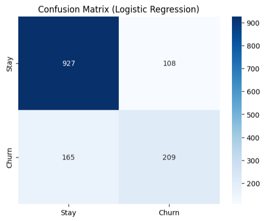
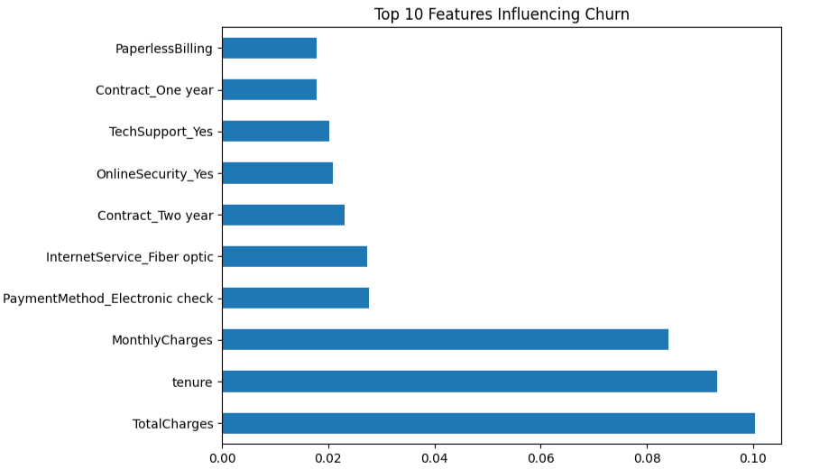

# 📊 Customer Churn Prediction (Telco Dataset)

## 📌 Problem Statement
Customer churn is one of the biggest challenges for subscription-based businesses like telecom providers. Retaining customers is more cost-effective than acquiring new ones.  
This project predicts **which customers are at risk of churning** using machine learning models and highlights the key drivers behind churn.

---

## 📂 Dataset
- **Source:** [Telco Customer Churn Dataset (Kaggle)](https://www.kaggle.com/blastchar/telco-customer-churn)  
- **Rows:** ~7,000 customers  
- **Target Variable:** `Churn` (Yes = customer left, No = customer stayed)  
- **Features:** Demographics, services signed up for, contract type, tenure, monthly/total charges, payment method, etc.  

---

## 🛠 Methodology
1. **Data Cleaning**
   - Handled missing/blank values in `TotalCharges`.
   - Encoded categorical variables into numeric (Yes/No → 1/0, One-hot encoding for multi-category features).
   - Removed duplicates, dropped `customerID`.

2. **Modeling**
   - Split dataset into **80% training** and **20% testing**.
   - Trained two models:
     - Logistic Regression (baseline)
     - Random Forest Classifier (comparison)

3. **Evaluation**
   - Used **confusion matrix** and **classification report** (accuracy, precision, recall, F1-score).
   - Compared models for strengths and weaknesses.

4. **Insights**
   - Analyzed **feature importance** (Random Forest) to find the main drivers of churn.

---

## 📊 Results

### Confusion Matrix (Logistic Regression)
The model achieved **81% accuracy**.  
It correctly predicted **927 customers who stayed** and **209 customers who churned**, but missed **165 churners**.  

---

### Feature Importance (Random Forest)
Random Forest analysis showed that **contract type**, **tenure**, and **monthly charges** were the most important factors influencing churn.  
Customers with **month-to-month contracts**, **short tenure**, and **higher charges** are most at risk.  

---

## 📌 Business Value
- Identifies **at-risk customers** so retention teams can intervene.  
- Provides insights into **why customers churn** → helps business adjust pricing, contracts, or customer support.  
- Can save revenue by focusing on customers with the highest churn probability.

---

## 🚀 Next Steps
- Improve recall for churn by:
  - Using **class balancing (SMOTE, class_weight)**.
  - Trying **XGBoost or LightGBM** for better performance.
- Deploy as a **Streamlit app** where business users can enter customer details and get churn prediction in real time.
